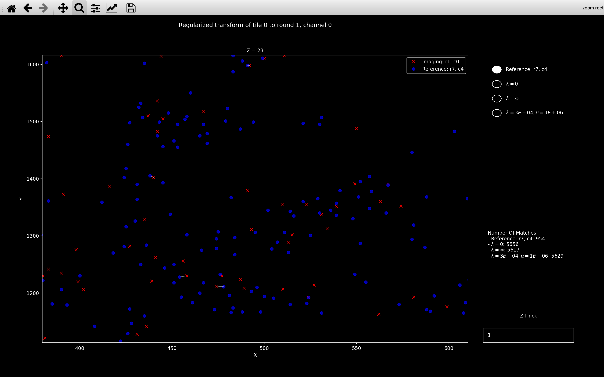
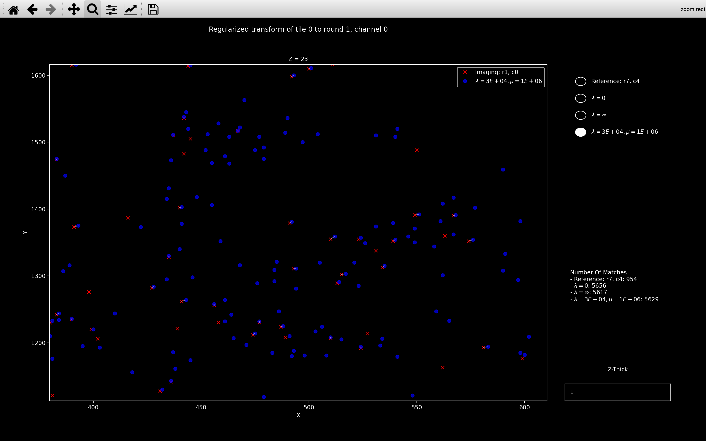
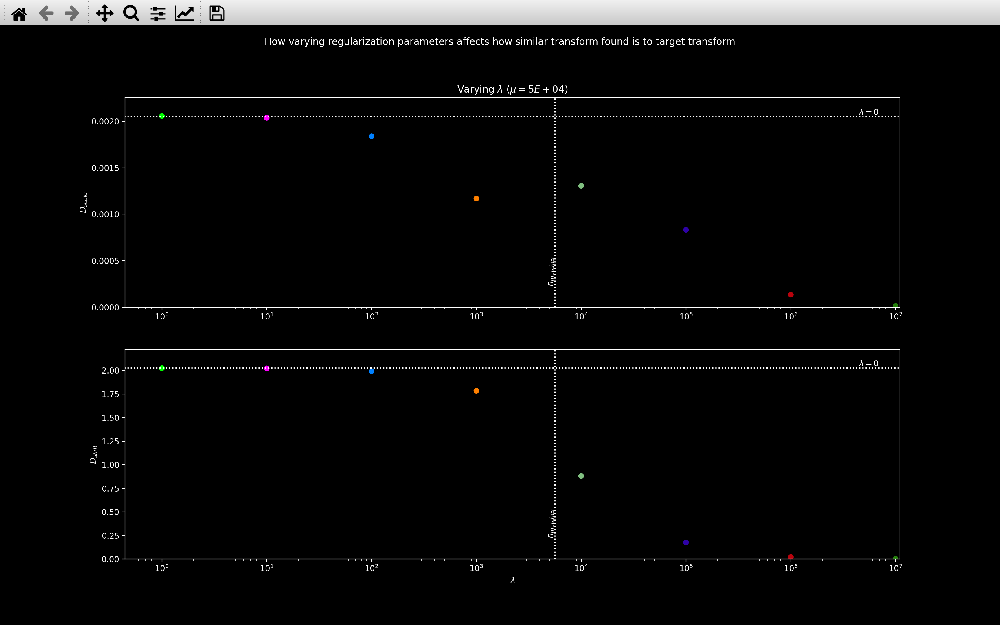
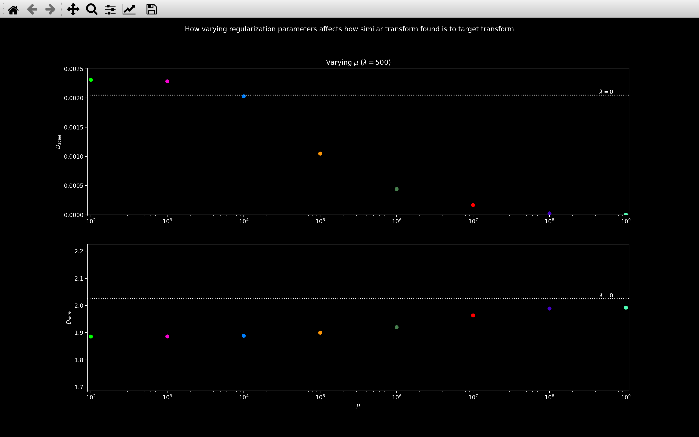
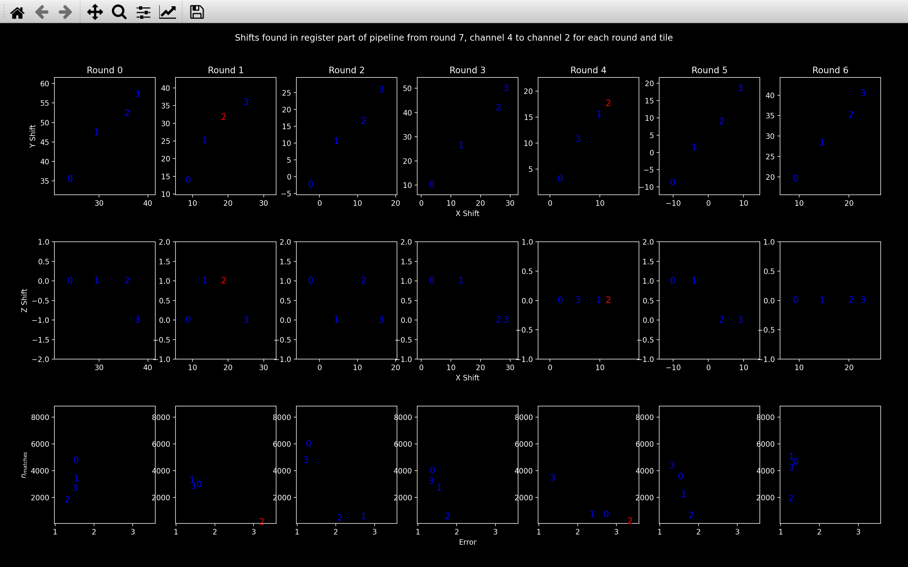
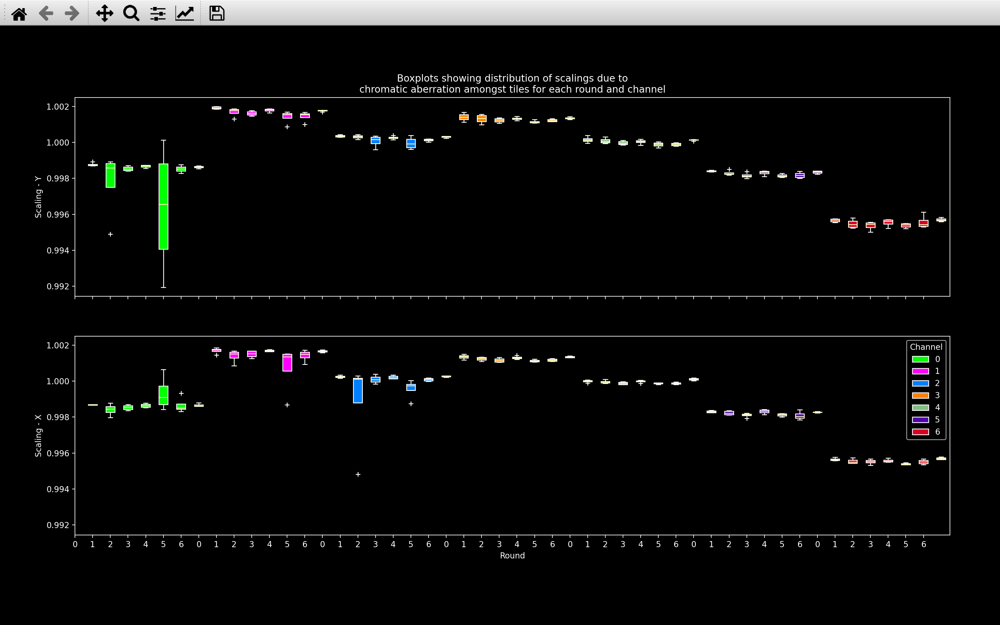
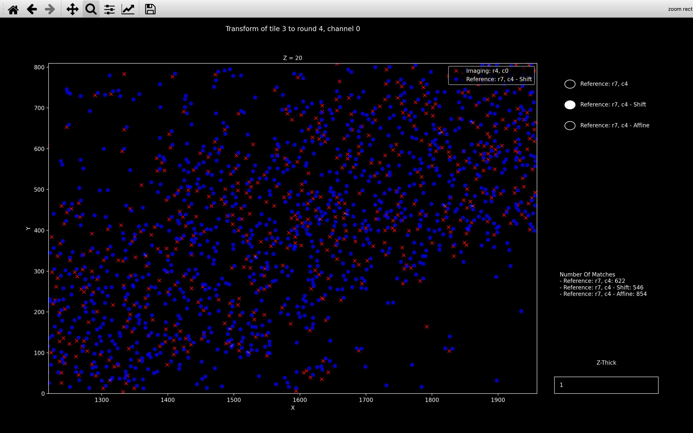
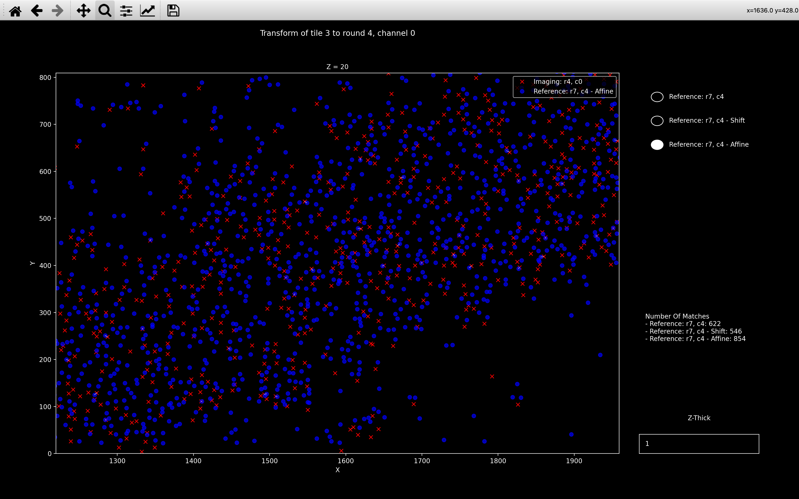

# Register
The [*register* step of the pipeline](../code/pipeline/register.md) finds an affine transform between
the reference round/reference channel ($r_{ref}$/$c_{ref}$) and each imaging round and channel for every tile.
The affine transform to tile $t$, round $r$, channel $c$ is found through iterative closest point
using the shift, `nb.register_initial.shift[t, r]`, found during the [*register_initial*](register_initial.md) step of 
the pipeline as the starting point. It is saved to the *Notebook* as `nb.register.transform[t, r, c]`.
These transforms are used later in the pipeline to determine the intensity of a pixel in each round and channel.

The [`register`](../notebook_comments.md#register) and [`register_debug`](../notebook_comments.md#register_debug) 
*NotebookPages* are added to the *Notebook* after this stage is finished.

## Affine Transform
We want to find the transform from tile $t$, round $r_{ref}$, channel $c_{ref}$ to round $r$, channel $c$ for all
tiles, rounds and channels such that there is pixel-level alignment between the images. The pixel-level 
alignment is important because most spots are only a few pixels in size, so even a one-pixel registration error 
can compromise the `spot_colors` found in the next stage of the pipeline and thus the gene assignment.

The shifts found in the [*register_initial*](register_initial.md) step of 
the pipeline are not sufficient for this, because of chromatic aberration which will cause a scaling between 
color channels. There may also be small rotational or non-rigid shifts; thus we find affine transformations 
which can include shifts, scalings, rotations and shears.

### Starting Transform
The affine transforms are found using the [iterative-closest point](../code/register/base.md#coppafish.register.base.icp) 
(*ICP*) algorithm. This is highly sensitive to local maxima, so it is initialized with the shifts found in the 
[*register_initial*](register_initial.md) step, `nb.register_initial.shift`.

The starting transform to a particular round and tile is the same for all channels. The shifts are put into
the form of an affine transform ($4 \times 3$ array) through 
[`transform_from_scale_shift`](../code/register/base.md#coppafish.register.base.transform_from_scale_shift).

??? example "Starting transform from shifts"
    The code below indicates how the initial shifts ($n_{tiles} \times n_{rounds} \times 3$ array) 
    are converted into initial transforms ($n_{tiles} \times n_{rounds} \times n_{channels} \times 4 \times 3$ array).
    
    === "Code"
        ``` python
        import numpy as np
        from coppafish.register.base import transform_from_scale_shift
        t_print = 1
        r_print = 1
        initial_shifts = nb.register_initial.shift   # z shift is in z-pixel units
        print(f"Initial shift for tile {t_print}, round {r_print}:\n{initial_shifts[t_print, r_print]}")

        # Convert z shift into same units as yx pixels
        initial_shifts = initial_shifts.astype(float)
        z_scale = [1, 1, nb.basic_info.pixel_size_z / nb.basic_info.pixel_size_xy]
        for t in nb.basic_info.use_tiles:
            for r in nb.basic_info.use_rounds:
                initial_shifts[t, r] = initial_shifts[t, r] * z_scale
        print(f"Initial shift for tile {t_print}, round {r_print} (z shift in YX pixels):\n"
              f"{np.around(initial_shifts[t_print, r_print], 2)}")
        
        # Convert shifts to affine transform 4 x 3 form
        initial_scale = np.ones((nb.basic_info.n_channels, 3))  # set all scalings to 1 initially 
                                                                # as just want shift.
        initial_transforms = transform_from_scale_shift(initial_scale, initial_shifts)
        
        # Show transform different for rounds but same for channel within round
        for r in range(2):
            for c in range(2):
                print(f"Initial transform for tile {t_print}, round {r}, channel {c}:\n"
                      f"{np.around(initial_transforms[t_print, r, c], 2)}")
        ```
    === "Output"
        ``` 
        Initial Shifts for tile 1, round 1:
        [25 14  1]
        Initial shift for tile 1, round 1 (z shift in YX pixels):
        [25.   14.    5.99]
        Initial transform for tile 1, round 0, channel 0:
        [[ 1.  0.  0.]
         [ 0.  1.  0.]
         [ 0.  0.  1.]
         [48. 30.  0.]]
        Initial transform for tile 1, round 0, channel 1:
        [[ 1.  0.  0.]
         [ 0.  1.  0.]
         [ 0.  0.  1.]
         [48. 30.  0.]]
        Initial transform for tile 1, round 1, channel 0:
        [[ 1.    0.    0.  ]
         [ 0.    1.    0.  ]
         [ 0.    0.    1.  ]
         [25.   14.    5.99]]
        Initial transform for tile 1, round 1, channel 1:
        [[ 1.    0.    0.  ]
         [ 0.    1.    0.  ]
         [ 0.    0.    1.  ]
         [25.   14.    5.99]]
        ```

### *ICP*
The pseudocode for the [*ICP*](../code/register/base.md#coppafish.register.base.icp) algorithm to 
find the affine transform for tile $t$ round $r$, channel $c$ is indicated below.
The shape of the various arrays are indicated in the comments (#).

??? note "Preparing point clouds"

    Prior to the *ICP* algorithm, the $yxz$ coordinates of spots on a tile
    are centered. This is because, it makes more sense to me if any rotation is applied around 
    the centre of the tile.

    Also, like for the initial shifts, the z-coordinates must be converted into units of yx-pixels,
    so overall:

    ``` python
    spot_yxz = spot_yxz - nb.basic_info.tile_centre  # center coordinates
    # Convert units of z-coordinates
    z_scale = [1, 1, nb.basic_info.pixel_size_z / nb.basic_info.pixel_size_xy]
    spot_yxz = spot_yxz * z_scale
    ```
    
    Also, for the non-reference point clouds we only keep spots which are isolated. This 
    is because the *ICP* algorithm is less likely to fall into local maxima if 
    the spots are quite well separated.
    
    We deam a spot [isolated](../code/find_spots/base.md#coppafish.find_spots.base.get_isolated_points) 
    if the nearest spot to it is further away than `2 * neighb_dist`.
    Where `neighb_dist = config['register']['neighb_dist_thresh_2d']` if *2D* and
    `config['register']['neighb_dist_thresh_3d']` if *3D*. 

`n_iter` is the maximum number of iterations and is set by `config['register']['n_iter']`. 
`neighb_dist_thresh` is the distance in $yx$ pixels below which neighbours are a good match. 
It is given by `config['register']['neighb_dist_thresh_2d']` if *2D* and
`config['register']['neighb_dist_thresh_3d']` if *3D*. 
Only neighbours which are closer than this are used when computing the transform.

??? note "Padding `ref_spot_yxz`"

    `ref_spot_yxz` has shape `[n_ref x 4]` not `[n_ref x 3]` because to be able to be multiplied by 
    the affine transform (`[4 x 3]`), it must be padded with ones i.e. `ref_spot_yxz[:, 3] = 1`.
    
    `ref_spot_yxz @ transform` is then the same as `ref_spot_yxz[:, :3] @ transform[:3, :] + transform[3]` i.e.
    rotation/scaling matrix applied and then the shift is added.

```
spot_yxz = yxz coordinates for spots detected on tile t,
           round r, channel c.  # [n_base x 3]
ref_spot_yxz = padded yxz coordinates for spots detected on tile t,
               reference round, reference channel.  # [n_ref x 4]                    
transform_initial = starting transform for tile t, round r, channel c.

transform = transform_initial  # [4 x 3]
neighb_ind = zeros(n_ref)      # [n_ref]
neighb_ind_last = neighb_ind   # [n_ref]
i = 0
while i < n_iter:
    1. Transform ref_spot_yxz according to transform to give 
       ref_spot_yxz_transform. # [n_ref x 3]
       This is just matrix multiplication.
              
    2. neighb_ind[s] is index of spot in spot_yxz closest to 
       ref_spot_yxz_transform[s].
        
    3. dist[s] is the distance between spot_yxz[neighb_ind[s]]
       and ref_spot_yxz_transform[s]  # [n_ref]
    
    4. Choose which spots to use to update the transform:
        use = dist < neighb_dist_thresh
        spot_yxz_use = spot_yxz[neighb_ind[use]]  # [n_use x 3]
        ref_spot_yxz_use = ref_spot_yxz[use]  # [n_use x 4]
    
    5. Update transform to be the 4x3 matrix which multiplies ref_spot_yxz_use
       such that the distances between the transformed spots 
       and spot_yxz_use are minimised. This is the least squares solution.
        
    6. If neighb_ind and neighb_ind_last are identical, then stop iteration
       i.e. i = n_iter.
    
    7. neighb_ind_last = neighb_ind
    
    8. i = i + 1
```

### Checking *ICP* results
Once the [*ICP*](#icp) algorithm has obtained a transform, `transform[t, r, c]` for each tile, round and channel, 
we want to determine if they are acceptable. Three criteria must be satisfied for 
`transform[t, r, c]` to be [considered acceptable](../code/register/base.md#coppafish.register.base.get_average_transform):

* [Number of matches exceeds threshold](#number-of-matches)
* [Diagonal elements of `transform[t, r, c]` are near to what we broadly expect them to be](#chromatic-aberration).
* [Shift part of `transform[t, r, c]` i.e. `transform[t, r, c][3]` is near to what we broadly expect it to be](#shift).

#### Number of matches
The number of matches, `n_matches[t, r, c]`, 
are the number of pairs of spots used to compute `transform[t, r, c]`, i.e. 
`n_use` in the above pseudocode, and thus it depends on the `neighb_dist_thresh` parameter. 
The number of matches are saved to the *Notebook* as `nb.register_debug.n_matches[t, r, c]`.

`transform[t, r, c]` is deemed to have failed if `n_matches[t, r, c] < n_matches_thresh[t, r, c]`.
`n_matches_thresh[t, r, c]` is computed as follows:

``` python
# n_ref[t] - number of spots detected on tile t,
#            reference round, reference channel
# n_base[t, r, c] - number of spots detected on tile t, 
#                   round r, channel c

# Set threshold to be fraction of max possible n_matches
n_matches_thresh[t, r, c] = thresh_fract * min(n_ref[t], n_base[t, r, c])

# Clip threshold between min and max
if n_matches_thresh[t, r, c] < thresh_min:
    n_matches_thresh[t, r, c] = thresh_min
if n_matches_thresh[t, r, c] > thresh_max:
    n_matches_thresh[t, r, c] = thresh_max
```

Where:

* `thresh_fract = config['register']['matches_thresh_fract]`. *Default: 0.25*
* `thresh_min = config['register']['matches_thresh_min]`. *Default: 25*
* `thresh_max = config['register']['matches_thresh_max]`. *Default: 300*

The default are parameters are such that in most cases, `n_matches_thresh[t, r, c] = thresh_max` so 
we require more than 300 matches for a transform to be acceptable. 
The matches thresholds are saved to the *Notebook* as `nb.register_debug.n_matches_thresh[t, r, c]`.


#### Chromatic Aberration
Our expectation of the transforms found is that there should be a scaling factor to 
correct for chromatic aberration between color channels. We do not expect significant scaling between rounds
for different tiles though.

Thus, we can compute the expected scaling for each transform to channel $c$ by averaging over all tiles 
and rounds. We also avoid transforms which have failed based on their [matches](#number-of-matches).

=== "Code"

    ``` python
    # transforms: [n_tiles x n_rounds x n_channels x 4 x 3]
    import numpy as np
    failed = n_matches < n_matches_thresh   # [n_tiles x n_rounds x n_channels]
    scaling = transforms[:, :, :, np.arange(3), np.arange(3)]  # [n_tiles x n_rounds x n_channels x 3]
    scaling = np.moveaxis(scaling, -1, 0)  # [3 x n_tiles x n_rounds x n_channels]
    failed = np.expand_dims(failed, 0).repeat(3, 0)  # [3 x n_tiles x n_riounds x n_channels]
    scaling[failed] = np.nan  # don't use failed t/r/c in average

    # Use median to take average as to avoid outlier values
    av_scaling = np.nanmedian(scaling, axis=[1, 2])  # average over tiles and rounds
    av_scaling = np.moveaxis(av_scaling, 0, -1)      # [n_channels x 3]
    print(av_scaling)
    ```
=== "Output"

    ```
    [[0.99863349 0.99863439 1.        ]
     [1.001767   1.00164772 1.        ]
     [1.00026354 1.00017105 1.        ]
     [1.00129138 1.00123909 1.        ]
     [1.00002731 0.99993372 1.        ]
     [0.99826052 0.99822415 1.        ]
     [0.99554262 0.99556903 1.        ]]
    ```

This gives us `av_scaling[c, i]` which is the scale factor for channel $c$ in dimension $i$ (order is $yxz$). 
This is saved to the *Notebook* as `nb.register_debug.av_scaling`. 
From the *Output* above, there is a clear difference between channels as we expect. Also, the $y$ and $x$ scaling
for a particular channel tend to be very similar but the $z$ scaling is always 1. This is because the z-pixels
are larger than the yx-pixels so there are no two pixels very close in $z$.

`transform[t, r, c]` is deemed to have failed if the scaling is significantly different from `av_scaling[c]` 
as quantified by:

`np.abs(transform[t, r, c][i, i] - av_scaling[c, i]) > scale_thresh[i]` for any dimension $i$. 

Here, `scale_thresh` is `config['register']['scale_dev_thresh']`. The default value of `[0.01, 0.01, 0.1]` is 
intended to be quite hard to exceed i.e. only really awful scaling will fail in this way. The $z$ threshold
is larger because if there is scaling in $z$, you would expect larger variance because the $z$-pixels are larger
than the $yx$-pixels (this may need looking at though, I am not too sure about it, but I think I made it
larger because quite a lot of transforms were failing based on the z-scaling).

#### Shift
Our expectation of the transforms found is that there should be a shift between rounds 
for a particular tile (in [*register_initial*](register_initial.md#updating-initial-range) 
we expected the shift to a particular round should be quite similar across tiles, we relax that here).
We do not expect significant shifts between channels for the same tile and round though.

Thus, we can compute the expected shift for each transform of tile $t$ to round $r$ by averaging over all channels. 
We also avoid transforms which have failed based on their [matches](#number-of-matches) or 
[scaling](#chromatic-aberration).

=== "Code"

    ``` python
    # transforms: [n_tiles x n_rounds x n_channels x 4 x 3]
    import numpy as np
    failed = np.logical_or(failed_matches, failed_scale)   # [n_tiles x n_rounds x n_channels]
    shifts = np.moveaxis(transforms[:, :, :, 3], -1, 0)  # [3 x n_tiles x n_rounds x n_channels]
    failed = np.expand_dims(failed, 0).repeat(3, 0)  # [3 x n_tiles x n_rounds x n_channels]
    shifts[failed] = np.nan  # don't use failed t/r/c in average
    
    # Use median to take average as to avoid outlier values
    av_shifts = np.nanmedian(shifts, axis=3)  # average over channels
    av_shifts = np.moveaxis(av_shifts, 0, -1)      # [n_tiles x n_rounds x 3]
    print(np.around(av_shifts[:4, :3,:], 2))
    ```
=== "Output"

    ```
    [[[35.79 24.04  0.  ]
      [14.49  9.23 -0.  ]
      [-2.25 -2.43  5.99]]

     [[47.74 30.01  0.  ]
      [25.26 13.78  5.99]
      [10.35  4.43 -0.  ]]

     [[52.54 36.04  0.  ]
      [32.24 21.99  5.99]
      [16.64 11.6   5.99]]

     [[57.75 38.31 -5.99]
      [38.57 27.41 -0.  ]
      [26.15 16.23  0.  ]]]
    ```
This gives us `av_shifts[t, r, i]` which is the average shift for tile $t$, round $r$ in dimension $i$ (order is $yxz$). 
This is saved to the *Notebook* as `nb.register_debug.av_shifts`. From the first 4 tiles and 3 rounds printed in 
*Output* above, we see that for a given round, there is significant variance across tiles 
(note that the z-shift is in units of $yx$-pixels, 5.99 in these units is 1 in z-pixels). 

??? note "Systematic shift between tiles"
    In the above *Output*, there seems to be a systematic shift between tiles:
    
    * The $y$ shifts for tile 1 for all rounds seem to be approximately equal to the tile 0 shifts + 11.
    * The $x$ shifts for tile 1 for all rounds seem to be approximately equal to the tile 0 shifts + 6.
    * The $y$ shifts for tile 2 for all rounds seem to be approximately equal to the tile 1 shifts + 6.
    * The $x$ shifts for tile 2 for all rounds seem to be approximately equal to the tile 1 shifts + 7.
    * The $y$ shifts for tile 3 for all rounds seem to be approximately equal to the tile 2 shifts + 5.
    * The $x$ shifts for tile 3 for all rounds seem to be approximately equal to the tile 2 shifts + 5.
    * The $z$ shifts for tile 3 for all rounds seem to be approximately equal to the tile 2 shifts - 5.99.
    
    I am not sure if this is seen in all experiments but if it is, it may be useful to 
    incorporate it into the code, both here and in the [*register initial*](register_initial.md) section.

`transform[t, r, c]` is deemed to have failed if the shift is significantly different from `av_shifts[t, r]` 
as quantified by:

`np.abs(transform[t, r, c][3, i] - av_shifts[t, r, i]) > shift_thresh[i]` for any dimension $i$. 

Here, `shift_thresh` is `config['register']['shift_dev_thresh']`. The default value of `[15, 15, 5]` is 
intended to be quite hard to exceed i.e. only really awful shifts will fail in this way. 
`config['register']['shift_dev_thresh'][2]` is in units of z-pixels and is converted to $yx$-pixels before
applying the thresholding (the default value of 5 will become 29.95 for our examples).

#### Error - average transform
When [computing](../code/register/base.md#coppafish.register.base.get_average_transform) `av_shifts[t, r]`, 
we require that for tile $t$, round $r$, at least one channel has not failed
based on [matches](#number-of-matches) or [scaling](#chromatic-aberration). If they have all failed, 
it cannot be computed and an error will be raised indicating the problematic tile/round pairs.

If this error occurs, it is probably worth using the [diagnostics](#debugging) to see why registration
produces few matches or bad scaling for these tile/round pairs.
If it seems to be a single tile or round that is the problem, it may be worth removing it from 
`use_tiles`/`use_rounds` and [re-running](../notebook.md#changing-basic_info-mid-pipeline).

When [computing](../code/register/base.md#coppafish.register.base.get_average_transform) `av_scaling[c]`, 
we require that for channel $c$, at least one round and tile has not failed
based on [matches](#number-of-matches). If they have all failed, 
it cannot be computed and an error will be raised indicating the problematic channels.

As $n_{tiles} \times n_{rounds} > n_{channels}$, this error is less likely to occur, but if it does, it 
is probably worth removing the indicated channels from `use_channels` and 
[re-running](../notebook.md#changing-basic_info-mid-pipeline).

### Regularized *ICP*
For the transforms which [failed](#checking-icp-results) (those for which `nb.register_debug.failed[t, r, c] == True`),
we save the failed transform as `nb.register_debug.transform_outlier[t, r, c]`.
We then re-run *ICP* to compute a new transform.
This time, though we want to ensure that `transform[t, r, c]` is pretty close to the `av_transform[t, r, c]`.

??? note "`av_transform`"

    `av_transform[t, r, c]` is the expected transform for tile $t$, round $r$, channel $c$.
    It is assumed to have no rotation, a scaling consistent with acceptable transforms to channel $c$
    and a shift consistent with acceptable transforms for tile $t$ to round $r$.
    
    The *Output* below shows the average transform for tile 1, round 0, channel 0 using the 
    [`av_scaling`](#chromatic-aberration) and [`av_shifts`](#shift) produced in the earlier sections.

    === "Code"
        ``` python
        av_transform = np.zeros((n_tiles, n_rounds, n_channels, 4, 3))
        for t in use_tiles:
            for r in use_rounds:
                for c in use_channels:
                    av_transform[t, r, c, 3] = av_shifts[t, r]
                    for i in range(3):
                        av_transform[t, r, c, i, i] = av_scaling[c, i]
        print(np.around(av_transform[1, 0, 0], 5))
        ```
    === "Output"
        ```
        [[ 0.99863  0.       0.     ]
         [ 0.       0.99863  0.     ]
         [ 0.       0.       1.     ]
         [47.73948 30.00533  0.     ]]
        ```

To do this, we set the initial transform for `transform[t, r, c]` to be `av_transform[t, r, c]`. 
The *ICP* algorithm is then the same as in the [pseudocode](#icp) except for section 5.
For normal least squares, we are finding the $4\times3$ transform $M$, 
such that the following loss function is minimised:

$$
L = \sum_{s=0}^{n_{neighb}-1} D_{s}^2 = \sum_{s=0}^{n_{neighb}-1} (y_s - x_sM)^2
$$

Where:

* $n_{neighb}$ is `n_use` introduced in step 4 of the [pseudocode](#icp).
* $y_s$ is `spot_yxz_use[s]` introduced in step 4 of the [pseudocode](#icp) ($n_{neighb} \times 3$)
* $x_s$ is `ref_spot_yxz_use[s]` introduced in step 4 of the [pseudocode](#icp) ($n_{neighb} \times 4$)

To keep $M$ close to the average transform, $M_a$, we find $M$ through regularized least
squares which minimises the following loss function:

$$
L = \sum_{s=0}^{n_{neighb}-1} D_{s}^2 + 0.5\lambda (\mu D_{scale}^2 + D_{shift}^2)
$$

Where:

* $D_{scale}^2 = \sum_{i=0}^2\sum_{j=0}^2(M_{ij} - M_{a_{ij}})^2$ is the squared
distance between `transform[:3, :]` and `av_transform[:3, :]` i.e. between the rotation/scaling $3\times3$ matrix part
of the transforms.
* $D_{shift}^2 = \sum_{j=0}^2(M_{3j} - M_{a_{3j}})^2$ is the squared
distance between `transform[3]` and `av_transform[3]` i.e. between the shift part of the transforms.
* $\lambda$ is `config['register']['regularize_constant']`. *Default: 500*
* $\mu$ is `config['register']['regularize_factor']`. *Default: $5\times10^4$*

??? note "Implementing regularized least squares in python"

    Lets suppose we are doing normal least squares with $n_{neighb} = 4$,

    $$
    x = \begin{pmatrix}
        \lambda_0 & 0 & 0 & 0\\
        0 & \lambda_0 & 0 & 0\\
        0 & 0 & \lambda_0 & 0\\
        0 & 0 & 0 & \lambda_1
        \end{pmatrix},
    $$
    
    $$
    y = xM_a
      = \begin{pmatrix}
        \lambda_0M_{a_{00}} & 0 & 0\\
        0 & \lambda_0M_{a_{11}} & 0\\
        0 & 0 & \lambda_0M_{a_{22}}\\
        \lambda_1M_{a_{30}} & \lambda_1M_{a_{31}} & \lambda_1M_{a_{32}}
        \end{pmatrix}
    $$

    Then the least squares solution for $M$ will be the one which minimises the loss function:
    
    $$
    L = \sum(y - xM)^2 = \sum x^2(M_a - M)^2 = \sum_{i=0}^3x_{ii}^2\sum_{j=0}^2(M_{ij} - M_{a_{ij}})^2 = 
    \lambda_0^2 D_{scale}^2 + \lambda_1^2 D_{shift}^2
    $$

    This matches the additional term in the regularised least squares loss function if:

    $$
    \lambda_0 = \sqrt{0.5\lambda\mu}
    $$

    $$
    \lambda_1 = \sqrt{0.5\lambda}
    $$

    Hence in [python](../code/register/base.md#coppafish.register.base.get_transform), 
    we append to the $y$ array containing `spot_yxz_use` the form of y here so
    it now has shape $(n_{neighb}+4) \times 3$. We also append to the $x$ array containing
    `ref_spot_yxz_use` the form of x here so it now has shape $(n_{neighb}+4) \times 4$.
    
    If we then just do normal least squares (`np.linalg.lstsq(x, y)`) on these modified $y$ and $x$ arrays,
    we get the regularized least squares solution for $M$. 

The intuition for suitable values of $\lambda$ and $\mu$ comes from the following:

* The desired distance between the shift found and the target shift, $D_{shift}$, 
is the equal to the average distance between neighbouring spots (the average of $D_s$). 
* If $\lambda = n_{neighb}$, the contribution of the two terms in the loss function will
then be equal if $\mu = D_{shift}^2/D_{scale}^2$ (in this case, regularised term
is $n_{neighb}D_{shift}^2$ but $D_{shift}^2$ is average of $D_s^2$ so this is equivalent to
$\sum_{s=0}^{n_{neighb}-1} D_{s}^2$).
* A typical value of $D_s$ is 2 (must be below `neighb_dist_thresh`) and a typical target value
of $D_{scale}$ is 0.009 hence $\mu = 2^2/0.009^2 \approx 5\times10^4$. 

    The larger $\mu$, the more the regularization will affect the scaling/rotation at the expense of the shift.

* Regularised term dominates the loss function if $\lambda > n_{neighb}$ so that as 
$\lambda \rightarrow \infty$, $M \rightarrow M_a$. Regularised term has little effect if $\lambda < n_{neighb}$
such that $M$ tends to the normal least squares solution as $\lambda \rightarrow 0$.

    Hence, the value of $\lambda$ should be thought of as an $n_{neighb}$ threshold. If there are more neighbours
    than $\lambda$ used to determine $M$ then we trust that this is enough to get the correct transform.
    If there are less than $\lambda$ neighbours used, we don't think this is enough to trust the transform it would
    produce freely, so we restrict the value of $M$ produced to be near the expected $M_a$. 

    Typically, 500 neighbours is quite a good value, `config['register']['regularize_constant']` 
    should always be larger than `config['register']['matches_thresh_max']`.

#### [`view_icp_reg`](../code/plot/register.md#view_icp_reg)
The function [`view_icp_reg`](../code/plot/register.md#view_icp_reg) is also useful for investigating
the effect of $\lambda$ and $\mu$.

It is very similar to [`view_icp`](#view_icp) but `view_icp_reg(t, r, c, reg_constant=[lambda1, lambda2], 
reg_factor=[mu1, mu2])`
will have blue point clouds corresponding to:

* Reference: Reference ($r_{ref}$/$c_{ref}$) point cloud for tile $t$ with no transform applied.
* $\lambda=0$: Reference point cloud transformed according to transform found with no regularization.
* $\lambda=\infty$: Reference point cloud transformed according to target transform for regularization, $M_a$.
This is found from `av_scaling[c]` and `av_shifts[t, r]` unless it is provided.
* $\lambda=$`lambda1`, $\mu=$`mu1`: Reference point cloud transformed according to transform found with 
regularized *ICP* using lambda1 and mu1 as the regularization parameters.
* $\lambda=$`lambda2`, $\mu=$`mu2`: Reference point cloud transformed according to transform found with 
regularized *ICP* using lambda2 and mu2 as the regularization parameters.

If `reg_constant` and `reg_factor` are not provided, `config['register']['regularize_constant']` and
`config['register']['regularize_factor']` will be used.

The example below shows the point clouds produced after running
`view_icp_reg(0, 1, 0, reg_constant=[3e4], reg_factor=[1e6])`:

=== "No transform"
    {width="800"}

=== "$\lambda=0$"
    {width="800"}

=== "$\lambda=\infty$"
    {width="800"}

=== "$\lambda=30000, \mu=1\times10^6$"
    {width="800"}

Here we see that all the transforms are visibly different but the $\lambda=30000, \mu=1\times10^6$ case
is closer to $\lambda=\infty$ than $\lambda=0$. This makes sense because as shown in the right sidebar 
of the plots, the number of matches is about 5600 so $\lambda = 30000 > n_{neighb}$ so 
the final transform should be close to the target transform we are regularising towards.

If [`view_icp_reg`](../code/plot/register.md#view_icp_reg) is run with `plot_residual=True`, it produces
another plot which indicates how $D_{shift}$ and $D_{scale}$ vary with different values of `reg_constant`
and `reg_factor`. 

`view_icp_reg(nb, 0, 1, 0, reg_constant=np.logspace(0, 7, 8), reg_factor=[5e4]*8, plot_residual=True)` 
produces the following additional plot:

{width="800"}

Here, each colored marker refers to a different $\lambda/\mu$ combination. 
The $\lambda=0$ horizontal line indicates the values with no regularisation and 
the $n_{matches}$ line indicates the number of matches found with $\lambda=\infty$. 

This plot nicely shows that for $\lambda < n_{matches}$, the transform found is pretty close to 
the normal least squares solution by for $\lambda > n_{matches}$, it is closer to the 
target transform we are regularising towards.

`view_icp_reg(nb, 0, 1, 0, reg_constant=[500] * 8, reg_factor=np.logspace(2, 9, 8), plot_residual=True)` 
produces the following additional plot:

{width="800"}

This shows that varying $\mu$ while keeping $\lambda$ constant does not affect $D_{shift}$ much 
but $D_{scale}$ does decrease as $\mu$ increases.

## Error - too few matches
After the `register` and `register_debug` *NotebookPages* have been 
[added](../code/pipeline/run.md#coppafish.pipeline.run.run_register)
to the *Notebook*, 
[`check_transforms`](../code/register/check_transforms.md#coppafish.register.check_transforms.check_transforms) will be run.

This will produce a warning for any tile, round, channel for which

`nb.register_debug.n_matches < nb.register_debug.n_matches_thresh`

An error will be raised if any of the following is satisfied:

* For any given channel, the number of transforms with 
`n_matches < n_matches_thresh` exceeds `error_fraction`.

    The faulty channels should then be removed from `use_channels`.

* For any given tile, the number of transforms with 
`n_matches < n_matches_thresh` exceeds `error_fraction`.

    The faulty tiles should then be removed from `use_tiles`.

* For any given round, the number of transforms with 
`n_matches < n_matches_thresh` exceeds `error_fraction`.

    The faulty rounds should then be removed from `use_rounds`.

`error_fraction` is given by `config['register']['n_transforms_error_fraction`].

## Debugging
There are a few functions using matplotlib which may help to debug this section of the pipeline.

### [`view_affine_shift_info`](../code/plot/register.md#view_affine_shift_info)
The [`view_affine_shift_info`](../code/plot/register.md#view_affine_shift_info) function
plots the shift part of the affine transform (`nb.register.transform[t, r, c, 3]`) to 
all tiles of a given round and channel on the same plot
(there are 3 plots for each round and channel).

It also includes a plot of `nb.register_debug.n_matches` vs `nb.register_debug.error` for each round and channel.
The error is the root-mean-square distance between neighbours used to compute the transform. Thus, the lower 
this value, and the higher $n_{matches}$, the better the transform.


=== "Channel 0"
    {width="800"}

=== "Channel 2"
    {width="800"}

The channel shown is changed by scrolling with the mouse and as a sanity check, we do not expect
the top two plots to vary much when the channel changes (the round 0 shifts above is quite a good example).

The numbers refer to the tile, and they are blue if 
`nb.register_debug.n_matches[t, r, c] > nb.register_debug.n_matches_thresh[t, r, c]`.
Otherwise, they are red, as with tile 2 in round 1 and 4 of the channel 2 plots.

As with [`view_register_shift_info`](register_initial.md#view_register_shift_info), this function 
can also be used to show `nb.register_debug.transform_outlier[t, r, c, 3]` by setting `outlier=True`, although 
the bottom plot will always show `nb.register_debug.n_matches` vs `nb.register_debug.error`.

### [`scale_box_plots`](../code/plot/register.md#scale_box_plots)
This function produces two or three plots, one for each dimension. In plot $i$, there is a boxplot 
for each round and channel of `nb.register.transform[:, r, c, i, i]`:

{width="800"}

In this plot, we expect for a given channel, the scaling should be similar across all rounds and tiles (i.e.
boxplots of the same color should be at the same height, and they should have quite small ranges with any 
outlier tiles (white crosses, +) not far from the boxplot). Also, we expect the *Scaling - Y* and
*Scaling - X* to be very similar. *Scaling - Z* will likely be different, but it won't be shown if
the range of *Scaling - Z* is less than 0.00001, which usually the case.

### [`view_icp`](../code/plot/register.md#view_icp)
This is similar to [`view_stitch_overlap`](stitch.md#view_stitch_overlap).
[`view_icp(nb, t, r, c)`](../code/plot/register.md#view_icp)
will always show the local coordinates of the point cloud for tile $t$, round $r$, channel $c$ in red.
This is `spot_yxz` in the [psuedocode](#icp).

There are then buttons to select which reference point cloud for tile $t$, round $r_{ref}$, channel 
$c_{ref}$ is plotted in blue:

* *No transform*: This is the reference point cloud with no transform applied
(`ref_spot_yxz` in the [psuedocode](#icp)).
* *Shift*: This is the reference point cloud, shifted according to `nb.register_initial.shifts[t, r]`
(`ref_spot_yxz_transform` computed in the first iteration in the [psuedocode](#icp))
* *Affine*: This is the reference point cloud, transformed according to `nb.register.transform[t, r, c]`
(`ref_spot_yxz_transform` computed in the last iteration in the [psuedocode](#icp))

An example is shown below:

=== "*No transform*"
    {width="800"}

=== "*Shift*"
    {width="800"}

=== "*Affine*"
    {width="800"}

If [regularized *ICP*](#regularized-icp) was required for the chosen tile/round/channel, an additional button 
will be present titled *Regularized*. The *Affine* button will then indicate 
the reference point cloud, transformed according to `nb.register_debug.transform_outlier` (i.e. with no regularization).
The *Regularized* button will indicate the reference point cloud, transformed according to 
`nb.register.transform[t, r, c]` (i.e. final transform found with regularization).

??? note "Can I use [`view_icp`](../code/plot/register.md#view_icp) before running the register stage of the pipeline?"

    The [`view_icp`](../code/plot/register.md#view_icp) function can be used after the `find_spots`
    page has been added to the *Notebook*. 

    In the case where the *Notebook* does not have the 
    `register_initial` page, the shift will be computed. In the case where the *Notebook* does not have the 
    `register` page, the affine transform will be 
    [computed](../code/register/base.md#coppafish.register.base.get_single_affine_transform) with no regularization.


## Psuedocode
This is the pseudocode outlining the basics of this [step of the pipeline](../code/pipeline/register.md).
For more detailed pseudocode about how the transform is found, see the [*ICP*](#icp) section.

```
r_ref = reference round
c_ref = reference round
spot_yxz[t, r, c] = yxz coordinates for spots detected on tile t,
                    round r, channel c.
for t in use_tiles:      
    Center reference point cloud:
        spot_yxz[t, r_ref, c_ref] = spot_yxz[t, r_ref, c_ref] - tile_centre
    Convert z coordinate into yx-pixels:
        spot_yxz[t, r_ref, c_ref][:, 2] = spot_yxz[t, r_ref, c_ref][:, 2] * z_scale
    for r in use_rounds:            
        for c in use_channels:
            Center point cloud:
                spot_yxz[t, r, c] = spot_yxz[t, r, c] - tile_centre
            Convert z coordinate into yx-pixels:
                spot_yxz[t, r, c][:, 2] = spot_yxz[t, r, c][:, 2] * z_scale
            Only keep spots whose nearest neighbour is far
                spot_yxz[t, r, c] = spot_yxz[t, r, c][isolated]           
            Find transform between spot_yxz[t, r_ref, c_ref] and 
                                   spot_yxz[t, r, c] using ICP.
                               
Compute av_scaling and av_shift.

transforms[t, r, c] is failed if one of the following is satisfied:
    - n_matches < n_matches_thresh.
    - transforms[t, r, c][i, i] significantly different to av_scaling[c, i] for any i.
    - transforms[t, r, c][3, i] significantly different to av_shift[t, r, i] for any i.

For failed transforms, recompute transform between 
    spot_yxz[t, r_ref, c_ref] and spot_yxz[t, r, c]
    using regularized ICP.           

Add transform to register NotebookPage.
Add debugging information to register_debug NotebookPage.      
Add register and register_debug NotebookPages to Notebook.  
```
